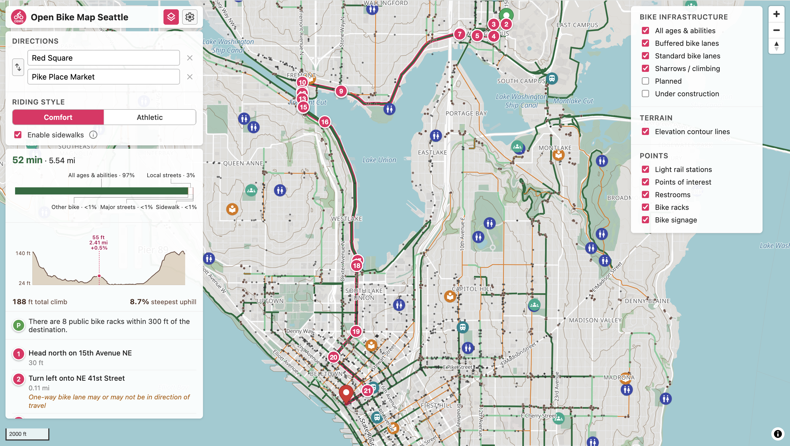

# Open Bike Map Seattle

A bike map for Seattle, built with large amounts of open data for better exploration and directions. Check it out at https://www.openbikemapseattle.com.

[](https://ko-fi.com/glennsun)



*Note: This repository contains code generated by AI.*

## Features 

**See more infrastructure at a glance.** Open Bike Map Seattle shows the following layers on the map:

* All ages & abilities routes, including neighborhood greenways
* Every public bike rack and bicycle wayfinding sign in the city
* Public restrooms, parks, and other points of interest
* Under construction routes and official city future plans

**Ride comfortably and safely.** Using city data and other sources, directions to your destination consider the following factors:

* The level of bike infrastructure
* How wide the roads are
* If protected crossings such as traffic signals are available
* How many turns are involved in the route
* Elevation, computed intelligently to recognize bridges and overpasses correctly

**And more miscellaneous features.**

* Works 100% offline
* Regular data updates will be available
* Sidewalk riding
* Customized profiles for your riding priorities

## Data sources

| Layer | Source |
|---|---|
| Bike facilities, multi-use trails, Bike+ Network, bike racks, wayfinding signs | [SDOT Open Data](https://data-seattlecitygis.opendata.arcgis.com/) |
| Traffic signals, stop signs, crosswalks, beacons, traffic circles | SDOT |
| Street centerlines, libraries, community centers, park restrooms | SDOT |
| Regional trails outside Seattle | [King County GIS](https://gis-kingcounty.opendata.arcgis.com/) |
| Light rail stations | [Sound Transit](https://www.soundtransit.org/) (via SDOT) |
| Street network, addresses, POIs | [OpenStreetMap](https://www.openstreetmap.org/) |
| Basemap tiles | [Protomaps](https://protomaps.com/) daily build |
| Elevation | [USGS 3DEP](https://www.usgs.gov/3d-elevation-program) 1/3 arc-second DTM |

## For developers

```bash
npm install
npm run dev      # http://localhost:5173
```

The shipped repo includes pre-built data (`public/data/`) and a Seattle
PMTiles extract (`public/tiles/`), so the app runs out of the box.

To refresh the data from upstream sources:

```bash
python3 -m venv .venv && source .venv/bin/activate
pip install requests shapely numpy rasterio scipy scikit-image
python3 scripts/fetch_data.py            # SDOT / King County GeoJSON
python3 scripts/build_graph.py           # routing graph from OSM + SDOT joins
python3 scripts/sample_dtm.py            # USGS elevation per node + per edge
python3 scripts/resolve_elevation.py     # heat-eq smoothing over bridges/tunnels
python3 scripts/build_addr_index.py      # OSM addresses + POIs
python3 scripts/build_data_manifest.py   # PWA version manifest (always last)
```

To refresh the basemap from a recent Protomaps daily build:

```bash
brew install pmtiles
bash scripts/make_basemap.sh YYYYMMDD    # pick a date from build.protomaps.com
```

To build for deploy:

```bash
npm run build:pwa     # icons, fonts, data manifest
npm run build         # vite → dist/
```

`vite.config.js` uses `base: './'`, so the build works under any GitHub
Pages path.

## Credits

Built on [MapLibre GL JS](https://maplibre.org/),
[Protomaps](https://protomaps.com/),
[PMTiles](https://github.com/protomaps/PMTiles),
[FlexSearch](https://github.com/nextapps-de/flexsearch), and the work of
OpenStreetMap, SDOT, King County GIS, and USGS. UI icons by Google
Material Symbols.
